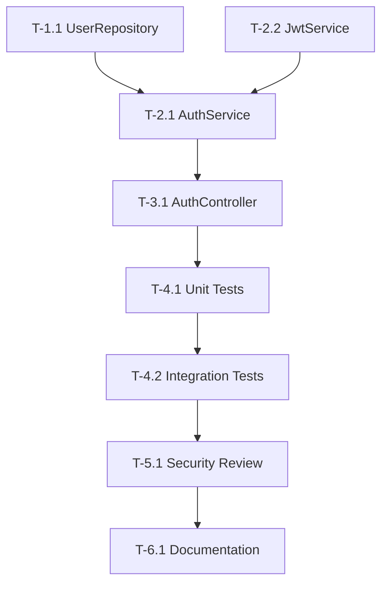

# Implementation Plan: user-auth-login

## Document Status
- **Feature ID**: `user-auth-login`
- **Version**: 1.0.0
- **Status**: Complete

---

## Implementation Strategy

采用**分层实现**策略，从数据层到 API 层逐步构建。

```
Controller Layer (AuthController)
        │
        ▼
Service Layer (AuthService)
        │
        ▼
Repository Layer (UserRepository)
        │
        ▼
Database (users table)
```

---

## Phase 1: 数据层

### T-1.1: 创建 UserRepository
- **角色**: developer
- **输入**: spec.md, users 表 schema
- **产出**: `src/repositories/UserRepository.ts`
- **验收**: 
  - [ ] `findByUsername(username)` 方法存在
  - [ ] 返回 User 或 null

---

## Phase 2: 服务层

### T-2.1: 实现 AuthService
- **角色**: developer
- **输入**: T-1.1, spec.md
- **产出**: `src/services/AuthService.ts`
- **验收**:
  - [ ] `login(username, password)` 方法存在
  - [ ] 密码验证逻辑正确
  - [ ] Token 生成正确

### T-2.2: 实现 JwtService
- **角色**: developer
- **输入**: spec.md
- **产出**: `src/services/JwtService.ts`
- **验收**:
  - [ ] `generateToken(user)` 方法存在
  - [ ] Token 包含 required claims

---

## Phase 3: API 层

### T-3.1: 实现 AuthController
- **角色**: developer
- **输入**: T-2.1, spec.md
- **产出**: `src/controllers/AuthController.ts`
- **验收**:
  - [ ] POST /api/auth/login 端点存在
  - [ ] 返回正确状态码
  - [ ] 错误处理符合 AC

---

## Phase 4: 测试

### T-4.1: 单元测试
- **角色**: tester
- **输入**: T-1.1, T-2.1, T-2.2, T-3.1
- **产出**: 测试文件
- **验收**:
  - [ ] AuthService 测试覆盖
  - [ ] JwtService 测试覆盖
  - [ ] AuthController 测试覆盖

### T-4.2: 集成测试
- **角色**: tester
- **输入**: T-4.1
- **产出**: 集成测试文件
- **验收**:
  - [ ] 登录成功场景
  - [ ] 登录失败场景

---

## Phase 5: 安全审查

### T-5.1: 安全检查
- **角色**: security
- **输入**: 所有代码
- **产出**: security-report
- **验收**:
  - [ ] 密码处理安全
  - [ ] Token 生成安全
  - [ ] 无敏感信息泄露

---

## Phase 6: 文档

### T-6.1: API 文档
- **角色**: docs
- **输入**: spec.md, implementation
- **产出**: API 文档更新
- **验收**:
  - [ ] 端点文档存在
  - [ ] 示例正确

---

## Dependencies



---

## Risk Assessment

| 风险 | 等级 | 缓解措施 |
|------|------|----------|
| 密码比对性能 | 中 | 使用 bcrypt.compare 异步方法 |
| Token 安全 | 高 | 使用强密钥，设置过期时间 |
| 错误信息泄露 | 中 | 统一返回模糊错误信息 |

---

## Estimated Effort

| Phase | 预计时间 |
|-------|----------|
| Phase 1 | 0.5h |
| Phase 2 | 1h |
| Phase 3 | 0.5h |
| Phase 4 | 1h |
| Phase 5 | 0.5h |
| Phase 6 | 0.5h |
| **总计** | **4h** |