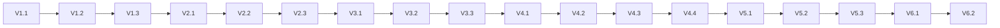

# Implementation Plan: 013-e2e-validation

## Document Status
- **Feature ID**: `013-e2e-validation`
- **Version**: 1.0.0
- **Status**: In Progress

---

## Implementation Strategy

采用**顺序验证**策略，依次执行每个 spec-* 命令并验证输出。

```
Phase 1: spec-start 验证
    ↓
Phase 2: spec-plan 验证
    ↓
Phase 3: spec-tasks 验证
    ↓
Phase 4: spec-implement 验证
    ↓
Phase 5: spec-audit 验证
    ↓
Phase 6: 生成验证报告
```

---

## Phase 1: spec-start 验证

### 目标
验证 `/spec-start` 命令能正确创建 feature spec。

### V-1.1: 检查 spec.md 存在
- 验证 `specs/013-e2e-validation/spec.md` 存在
- 验证 spec.md 包含所有必需章节（Background, Goal, Scope 等）

### V-1.2: 验证格式合规
- 检查是否使用正确的角色术语（6-role）
- 检查是否有 Assumptions 和 Open Questions 章节

### V-1.3: 记录验证结果
- 记录 spec-start 验证状态（PASS/FAIL）
- 记录任何发现的问题

**状态**: ✅ 完成（spec.md 已创建）

---

## Phase 2: spec-plan 验证

### 目标
验证 `/spec-plan` 命令能正确生成 implementation plan。

### V-2.1: 检查 plan.md 存在
- 验证 `specs/013-e2e-validation/plan.md` 存在
- 验证 plan.md 包含所有必需章节

### V-2.2: 验证 plan.md 格式
- 检查是否有 Implementation Strategy
- 检查是否有 Phase 分解
- 检查是否有 Dependencies 图
- 检查是否有 Risk Assessment

### V-2.3: 验证 architect 角色输出
- plan.md 应体现 architect 角色设计能力

**状态**: 🔄 进行中

---

## Phase 3: spec-tasks 验证

### 目标
验证 `/spec-tasks` 命令能正确生成 task list。

### V-3.1: 检查 tasks.md 存在
- 验证 `specs/013-e2e-validation/tasks.md` 存在

### V-3.2: 验证 tasks.md 格式
- 检查是否有 Task ID 列表
- 检查每个 task 是否有明确的描述和状态
- 检查是否有 task dependencies

### V-3.3: 验证任务与 plan 对应
- tasks 应与 plan.md 中的 phases 对应

---

## Phase 4: spec-implement 验证

### 目标
验证 `/spec-implement` 命令能正确执行实现流程。

### V-4.1: 验证 developer 角色执行
- 检查是否正确应用 developer skills
- 检查是否有实现摘要输出

### V-4.2: 验证 tester 角色执行
- 检查是否正确应用 tester skills
- 检查是否有测试验证

### V-4.3: 验证 docs 角色执行
- 检查文档同步是否正确

### V-4.4: 检查 completion-report.md
- 验证 `specs/013-e2e-validation/completion-report.md` 存在
- 验证报告内容完整

---

## Phase 5: spec-audit 验证

### 目标
验证 `/spec-audit` 命令能正确执行审计流程。

### V-5.1: 检查审计报告存在
- 验证审计输出存在

### V-5.2: 验证 reviewer 角色执行
- 检查是否正确应用 reviewer skills
- 检查审计格式是否符合 audit-checklist-template.md

### V-5.3: 验证审计规则
- 检查 AH-001 至 AH-006 是否被正确执行
- 检查 findings severity 分类是否正确

---

## Phase 6: 生成验证报告

### 目标
生成最终的端到端验证报告。

### V-6.1: 创建 verification-report.md
- 包含所有 phase 的验证结果
- 包含总体评估（PASS/FAIL）
- 包含发现的问题和建议

### V-6.2: 更新 README.md
- 添加 013-e2e-validation feature 到 README
- 更新 feature 状态表格

---

## Dependencies



---

## Risk Assessment

| 风险 | 等级 | 缓解措施 |
|------|------|----------|
| 命令执行失败 | 低 | 每个 phase 有独立验证点 |
| artifact 格式不合规 | 中 | 参考已有 feature 作为模板 |
| 角色协同问题 | 中 | 使用 collaboration-protocol.md 作为指导 |
| 审计规则遗漏 | 低 | 使用 audit-checklist-template.md |

---

## Estimated Effort

| Phase | 预计时间 |
|-------|----------|
| Phase 1 | 5min |
| Phase 2 | 10min |
| Phase 3 | 10min |
| Phase 4 | 15min |
| Phase 5 | 10min |
| Phase 6 | 10min |
| **总计** | **60min** |

---

## Validation Criteria

本 feature 完成的标准：

1. 所有 6 个 phases 成功执行
2. 每个 spec-* 命令输出预期 artifact
3. 审计报告格式合规
4. verification-report.md 总结所有验证结果