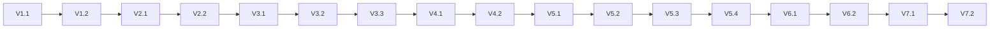

# Implementation Plan: 014-enhanced-mode-validation

## Document Status
- **Feature ID**: `014-enhanced-mode-validation`
- **Version**: 1.0.0
- **Status**: In Progress
- **Mode**: **Enhanced** (enhanced: true in spec.md)

---

## Implementation Strategy

采用**顺序验证**策略，依次验证每个 M4 skill 的触发机制和执行能力。

```
Phase 1: Enhanced 模式激活验证
    ↓
Phase 2: Architect M4 Skills 验证
    ↓
Phase 3: Tester M4 Skills 验证
    ↓
Phase 4: Developer M4 Skills 验证
    ↓
Phase 5: Reviewer/Security M4 Skills 验证
    ↓
Phase 6: Docs M4 Skills 验证
    ↓
Phase 7: 生成验证报告
```

---

## Enhanced Mode Metadata

```yaml
enhanced_mode:
  activated: true
  source: "spec.md frontmatter"
  inherited_by:
    - spec-plan
    - spec-tasks
    - spec-implement
    - spec-audit
```

---

## Phase 1: Enhanced 模式激活验证

### 目标
验证 Enhanced 模式能正确激活并继承。

### V-1.1: 验证 spec.md 元数据
- 检查 `enhanced: true` 存在于 spec.md frontmatter
- 验证后续命令能读取并继承此设置

### V-1.2: 验证模式继承
- plan.md 应显示 Enhanced 模式激活
- tasks.md 应继承 Enhanced 模式
- implement 和 audit 应使用 Enhanced 模式

**状态**: ✅ 验证中

---

## Phase 2: Architect M4 Skills 验证

### 目标
验证 architect 角色的 M4 skills 能正确触发。

### V-2.1: Interface Contract Design (M4)
**触发条件**: Feature 涉及新 API 或接口设计

本 feature 验证接口：
- `/spec-start --enhanced` 命令接口
- `enhanced-mode-selector.md` 检测接口
- M4 skill 触发条件接口

**验证输出**:
- `contracts/interface-contract.md` (如适用)

### V-2.2: Migration Planning (M4)
**触发条件**: Feature 涉及数据库迁移或系统升级

本 feature 不涉及数据迁移，此 M4 skill **不应触发**。

**验证**: 确认 migration-planning 未被错误触发

---

## Phase 3: Tester M4 Skills 验证

### 目标
验证 tester 角色的 M4 skills 能正确触发。

### V-3.1: Integration Test Design (M4)
**触发条件**: Feature 有集成点

本 feature 验证集成点：
- Enhanced 模式与 MVP 模式集成
- M4 skills 与 MVP skills 集成
- 命令间 enhanced 元数据继承

**验证输出**:
- tasks.md 应包含 integration test tasks

### V-3.2: Performance Test Design (M4)
**触发条件**: Feature 有性能需求

本 feature 有性能验证需求：
- NFR-001 要求 Enhanced 模式不显著增加执行时间

**验证输出**:
- 可选的性能测试 task

### V-3.3: Flaky Test Diagnosis (M4)
**触发条件**: 存在不稳定测试

本 feature 不涉及 flaky tests，此 M4 skill **不应触发**。

---

## Phase 4: Developer M4 Skills 验证

### 目标
验证 developer 角色的 M4 skills 能正确触发。

### V-4.1: Refactor Safely (M4)
**触发条件**: Task 涉及重构现有代码

本 feature 不涉及重构，此 M4 skill **不应触发**。

### V-4.2: Dependency Minimization (M4)
**触发条件**: Feature 需要新依赖

本 feature 不需要新依赖，此 M4 skill **不应触发**。

---

## Phase 5: Reviewer/Security M4 Skills 验证

### 目标
验证 reviewer 和 security 角色的 M4 skills 能正确触发。

### V-5.1: Maintainability Review (M4) - **P1 验证**
**触发条件**: Enhanced 模式下的审计阶段

**验证输出**:
- audit-report.md 应包含 maintainability 章节
- 评估代码可维护性评分

### V-5.2: Risk Review (M4) - **P1 验证**
**触发条件**: Enhanced 模式下的审计阶段

**验证输出**:
- audit-report.md 应包含 risk assessment 章节
- 识别技术风险和缓解措施

### V-5.3: Secret Handling Review (M4)
**触发条件**: Feature 处理敏感信息

本 feature 不处理敏感信息，此 M4 skill **不应触发**。

### V-5.4: Dependency Risk Review (M4)
**触发条件**: Feature 添加新依赖

本 feature 不添加新依赖，此 M4 skill **不应触发**。

---

## Phase 6: Docs M4 Skills 验证

### 目标
验证 docs 角色的 M4 skills 能正确触发。

### V-6.1: Architecture Doc Sync (M4) - **P2 验证**
**触发条件**: Feature 改变架构

本 feature 验证 Enhanced 模式架构，应触发此 M4 skill。

**验证输出**:
- 更新 docs/enhanced-mode-guide.md (如需要)
- 更新 README.md Enhanced 模式章节

### V-6.2: User Guide Update (M4)
**触发条件**: Feature 改变用户交互

本 feature 不改变用户交互，此 M4 skill **不应触发**。

---

## Phase 7: 生成验证报告

### 目标
生成 Enhanced 模式验证报告。

### V-7.1: 创建 verification-report.md
- 包含所有 M4 skills 触发状态
- 包含 Enhanced 模式激活验证结果
- 包含 P1/P2/P3 skills 验证矩阵

### V-7.2: 更新 README.md
- 添加 014-enhanced-mode-validation feature
- 更新 Enhanced 模式验证状态

---

## M4 Skills Trigger Matrix

| M4 Skill | Role | Trigger Condition | Expected Status | Priority |
|----------|------|-------------------|-----------------|----------|
| interface-contract-design | architect | Feature 涉及 API | ⚠️ OPTIONAL | P2 |
| migration-planning | architect | 数据迁移 | ❌ NOT TRIGGERED | P2 |
| refactor-safely | developer | 重构代码 | ❌ NOT TRIGGERED | P3 |
| dependency-minimization | developer | 新依赖 | ❌ NOT TRIGGERED | P3 |
| integration-test-design | tester | 集成点 | ✅ TRIGGERED | P1 |
| flaky-test-diagnosis | tester | 不稳定测试 | ❌ NOT TRIGGERED | P3 |
| performance-test-design | tester | 性能需求 | ⚠️ OPTIONAL | P2 |
| benchmark-analysis | tester | 性能对比 | ❌ NOT TRIGGERED | P3 |
| load-test-orchestration | tester | 承载验证 | ❌ NOT TRIGGERED | P3 |
| performance-regression-analysis | tester | 版本发布 | ❌ NOT TRIGGERED | P3 |
| maintainability-review | reviewer | Enhanced 审计 | ✅ TRIGGERED | P1 |
| risk-review | reviewer | Enhanced 审计 | ✅ TRIGGERED | P1 |
| architecture-doc-sync | docs | 架构变更 | ✅ TRIGGERED | P2 |
| user-guide-update | docs | 用户交互 | ❌ NOT TRIGGERED | P3 |
| secret-handling-review | security | 敏感信息 | ❌ NOT TRIGGERED | P3 |
| dependency-risk-review | security | 新依赖 | ❌ NOT TRIGGERED | P3 |

**统计**:
- ✅ TRIGGERED: 4 个 (P1: 2, P2: 2)
- ⚠️ OPTIONAL: 2 个
- ❌ NOT TRIGGERED: 10 个 (条件不满足)

---

## Dependencies



---

## Risk Assessment

| 风险 | 等级 | 缓解措施 |
|------|------|----------|
| M4 skill 未正确触发 | 中 | 每个阶段显式验证触发状态 |
| Enhanced 模式继承失败 | 低 | 每个文档检查 enhanced 元数据 |
| M4 skill 输出格式不兼容 | 低 | 验证输出包含必需章节 |

---

## Estimated Effort

| Phase | 预计时间 |
|-------|----------|
| Phase 1 | 10min |
| Phase 2 | 10min |
| Phase 3 | 15min |
| Phase 4 | 10min |
| Phase 5 | 15min |
| Phase 6 | 10min |
| Phase 7 | 10min |
| **总计** | **80min** |

---

## Enhanced Mode Output Requirements

### plan.md (本文档) 应包含:
- [x] Enhanced Mode Metadata 章节
- [x] M4 Skills Trigger Matrix
- [x] 每个 Phase 标注 M4 skill 触发状态

### tasks.md 应包含:
- [ ] Enhanced Mode 继承标记
- [ ] M4 skill 相关 tasks
- [ ] Integration test tasks

### completion-report.md 应包含:
- [ ] M4 skills 应用记录
- [ ] Enhanced 模式执行摘要

### audit-report.md 应包含:
- [ ] Maintainability Review 章节
- [ ] Risk Review 章节
- [ ] Enhanced Audit Summary